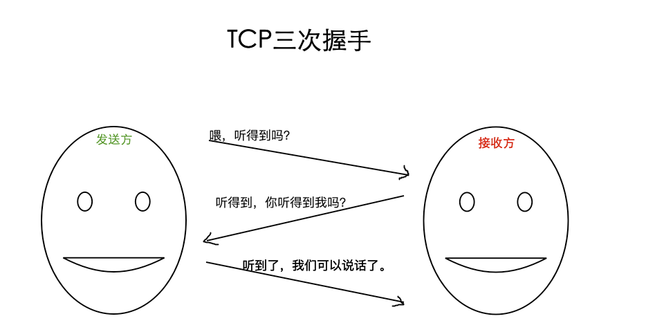

# 概念

## TCP三次握手/四次挥手


https://my.oschina.net/liting/blog/402859

## CSP (Content Security Policy)
“网页安全政策”。
CSP 的实质就是白名单制度，开发者明确告诉客户端，哪些外部资源可以加载和执行，等同于提供白名单。它的实现和执行全部由浏览器完成，开发者只需提供配置。
- 两种方法可以启用 CSP
    - 通过 HTTP 头信息的Content-Security-Policy的字段。
    - 通过网页的meta标签。
```
Content-Security-Policy: script-src 'self'; object-src 'none';
style-src cdn.example.org third-party.org; child-src https:
```
或  
```
<meta http-equiv="Content-Security-Policy" content="script-src 'self'; object-src 'none'; style-src cdn.example.org third-party.org; child-src https:">
```
以上的配置意为：
- 脚本：只信任当前域名
- object标签：不信任任何URL，即不加载任何资源
- 样式表：只信任cdn.example.org和third-party.org
- 框架（frame）：必须使用HTTPS协议加载
- 其他资源：没有限制

http://www.ruanyifeng.com/blog/2016/09/csp.html

## MVVM MVC

## 状态管理 flux redux

## 设计模式
[观察者模式和发布订阅模式的区别](https://www.jianshu.com/p/594f018b68e7)
最大的区别就是发布订阅模式有个**事件调度中心**


